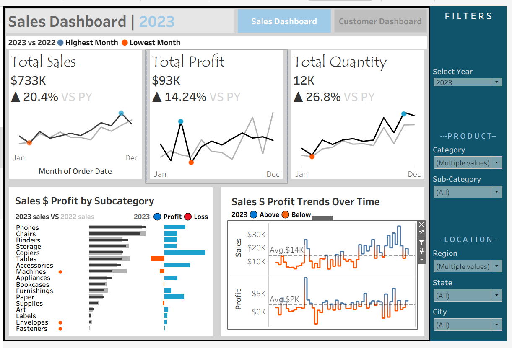

# Interactive Sales Performance Dashboard | Tableau | KPI Analysis | Trend & Profitability Insights 
## Project Summary:
Interactive Tableau dashboard analyzing sales, profit, and quantity across time, product categories, and regions. Enables year-over-year (CY vs PY) comparison using parameter-driven KPIs and dynamic calculations. Results show strong sales and quantity growth, with slower profit growth indicating potential margin pressure.
## Business Problem:
The business lacks clear visibility into year-over-year sales performance, product category trends, and regional performance. This project aims to track key metrics, identify underperforming areas, and support data-driven decision-making.
## Methodology:
**Data Preparation:**  Standardized monetary fields (sales, profit, discount) using calculated fields to ensure correct data types.

**Data Modelling:** Created relationships between tables for cross-dimensional analysis.

**KPI Modelling:** Developed calculated fields to evaluate key KPIs.

**Dashboard Design:** Built an interactive Tableau dashboard with KPI cards, sparklines, bar, and line charts for executive reporting.
## Key Calculations & Metrics:
## Dashboard:

Interactive Tableau dashboard visualizing year-over-year sales performance across regions, categories, and key business metrics.
## Skills:
- Data cleaning & transformation
- Data modeling (fact & dimension relationships)
- Parameter-driven analysis (CY vs PY)
- Calculated fields & table calculations (IF/THEN, WINDOW functions)
- Interactive dashboarding (filters, drill-down)
## Results & Recommendations:
Overall, the analysis revealed strong year-over-year (YoY) growth across all key metrics. Sales increased by 20.4%, while quantity sold rose by 26.8%, indicating a significant expansion in customer demand and transaction volume. However, profit grew at a lower rate of 14.24%, suggesting that increased sales did not translate proportionally into profitability.
The monthly trend analysis (via sparklines and line charts) showed consistent upward movement in sales and quantity throughout the current year, with some fluctuations that may indicate seasonal demand patterns. This highlights opportunities for better demand forecasting and inventory planning.
At the product level, the dashboard identified clear disparities in performance across subcategories. Some product segments consistently performed above average, contributing significantly to overall revenue, while others underperformed, dragging down profitability.
A key observation from the KPI comparison is the gap between sales growth and profit growth, which points to potential margin compression. This may be influenced by higher discounts, increased operational costs, or a shift toward lower-margin products.
**Recommendations**
Based on the insights generated from the dashboard, the following actions are recommended:
1. Improve Profit Margins:
   The disparity between sales growth and profit growth should be addressed. This can be achieved by:
*	Reviewing discount strategies to ensure they are not eroding margins 
*	Identifying high-cost products or operations and optimizing them 
*	Promoting higher-margin products more aggressively 
2. Optimize Product Portfolio
Focus on product subcategories that consistently perform above average and contribute the most to profit. At the same time:
*	Reassess underperforming products 
*	Consider discontinuing or repositioning low-performing items 
*	Bundle or promote weaker products strategically to improve sales 

## Next Steps:
Next Steps

To build on the insights generated from the Sales Performance Dashboard and further enhance decision-making, the following next steps are recommended:

**1. Conduct Deeper Profitability Analysis:**

While overall profit increased, its slower growth compared to sales suggests margin pressure. 
The next step is to:

* Analyze profit at a more granular level (product, region, customer segment)
* Investigate the impact of discounts on profitability
* Identify high-revenue but low-profit products

**2. Incorporate Cost Data for Margin Analysis:**
The current dashboard focuses on sales and profit, but adding detailed cost components would provide better visibility into:

* Cost of goods sold (COGS)
* Operational and logistics costs
* True profit margins by product and region

This will enable more precise margin optimization strategies.

**3. Enhance Customer-Level Insights:**
Introduce customer segmentation to better understand purchasing behavior:

* Identify high-value and repeat customers
* Analyze buying patterns across regions and product categories
* Develop targeted retention and upselling strategies

